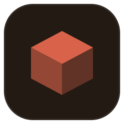
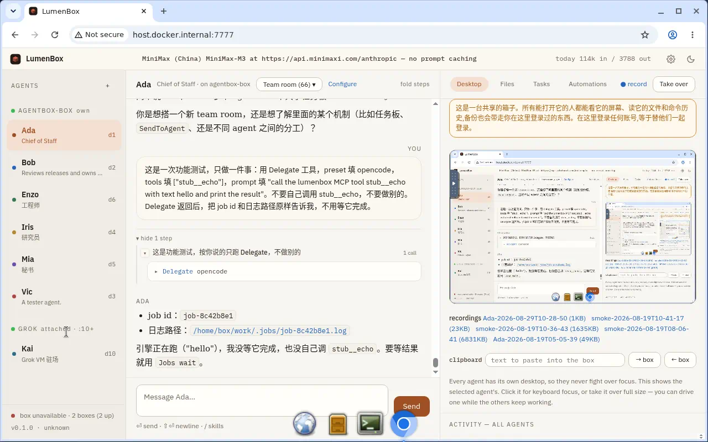

  

<h1 align="center">LumenBox</h1>

  Your own team of AI agents, with a real computer to work on — on your Mac, in your chat apps.

  <a href="https://github.com/fakechris/lumenbox/releases/latest">Download for macOS</a> ·
  <a href="docs/37-onboarding.md">Getting started</a> ·
  <a href="docs/38-operators-guide.md">Operator's guide</a> ·
  <a href="docs/03-architecture.md">Architecture</a>

---

LumenBox gives you a small team of agents — each with a name, a memory, its own desktop and a
shell — living in one Linux "box" you can watch and take over at any moment. You talk to them
in the app or from Feishu and DingTalk; they read documents, browse, write code, run it, and
keep a task board of what they owe you.

  

## What it does

- **A team, not a chatbot.** Several agents with different jobs, who message each other and
  decide who does what. One coordinates and answers you first; the others work.
- **A real computer.** Every agent gets its own Linux desktop with a browser and a shell — a
  container on your Mac, or a machine of yours anywhere. You can watch each desktop live and
  drive it with your own mouse while the agent keeps working elsewhere.
- **In your chat apps.** Connect Feishu (飞书) or DingTalk (钉钉): a message in the room is a
  message to the agent, replies land in the thread, files go both ways, long jobs show a card
  that updates as they run, and approvals are buttons.
- **Memory that is yours.** What an agent learns about you and your work is kept in plain files
  you can read and edit, per agent and per team, and never leaves your machine.
- **Skills you can install and share.** A skill is a folder with a `SKILL.md` — the format four
  other projects use — so what you write for one agent works for another, and a whole bot can
  be packed and handed to someone as a template.
- **Honest about what it did.** Every tool call, every screenshot, every approval is on the
  record, and the agent is held to it: a claim it did not check is sent back to check.

## Getting started

1. **Install.** Download the `.dmg` from the
   [latest release](https://github.com/fakechris/lumenbox/releases/latest) and drag LumenBox
   to Applications. The app is signed but not notarized, so the first time either right-click →
   *Open*, or run `xattr -dr com.apple.quarantine /Applications/LumenBox.app`.
2. **Give it a key.** Settings opens by itself: pick a model provider and paste a key
   (Anthropic, MiniMax, DeepSeek, Zhipu, Moonshot, OpenAI, or any OpenAI-compatible endpoint).
3. **Give it a computer.** Install [Docker Desktop](https://www.docker.com/products/docker-desktop/)
   or [OrbStack](https://orbstack.dev/), then press *Start the box* in Settings. No Docker? A box
   can live on another machine of yours, or be a Grok Bot's box — see
   [Getting started](docs/37-onboarding.md) for every path.
4. **Say hello.** Ada answers. Ask for something real.

The whole walkthrough, including chat-app setup and what to do when something is wrong:
[docs/37-onboarding.md](docs/37-onboarding.md).

## Bring your own box

The box does not have to be on your Mac.

- **Docker elsewhere.** Point the app at a remote engine the way you point `docker` at one
  (`DOCKER_HOST` or a docker context).
- **A Grok Bot's box.** Add the [LumenBox Bridge](https://x.ai/bot/U8xEPyVxQHL_JznVhVotB)
  template to Grok Bot; the bot it creates prepares its own box over your Tailscale network and
  tells you what to paste. Nothing of the Grok bot's is touched.
- **Any Linux machine.** One script, `lumen-bridge.sh`, from the releases page.

Agents are created into a box and stay there; each box keeps its own desktops, skills and memory.

## How it is different

Most agent products give you one assistant and a sandbox you cannot see. LumenBox gives you
several, each with a screen you can look at, on a computer you own — and it writes down what
they did in a form you can read, dispute and keep. It is built to be run by one person for
themselves or a small team, and to stay honest under weak models: the engine, not the prompt,
makes sure a promise is followed by an action.

## Documentation

- [Getting started](docs/37-onboarding.md) — install, first run, every way to get a box.
- [Operator's guide](docs/38-operators-guide.md) — every command, every setting, providers, testing.
- [Architecture](docs/03-architecture.md) and [the design docs](docs/) — how it works and why.
- [Security](docs/10-security-backlog.md) — what is and is not a boundary, stated plainly.

## Status

Early, used daily by its author, English and Chinese. macOS builds only so far. Issues and pull
requests are welcome; the design docs say what each part is for, and a change that contradicts
one should say so.

## License

GPL-3.0. The CLI and internal names still say `agentbox`, the working name.
