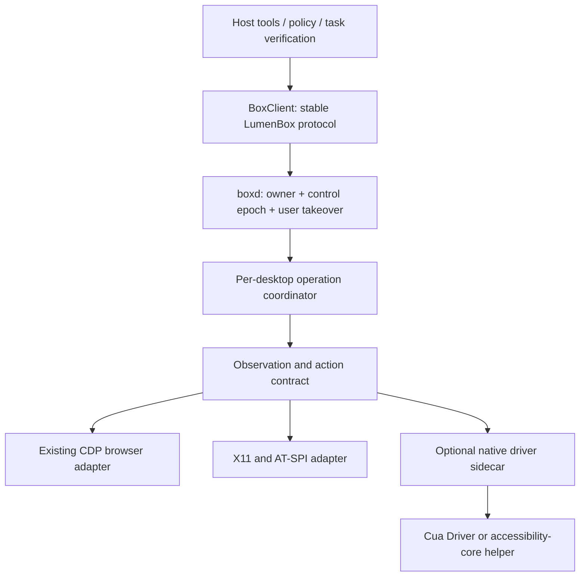

<!-- doc: 62-cua-driver-research
     title: CUA 三方研究：执行合同、依赖取舍与渐进改造
     family: decision
     status: current
     updated: 2026-09-22
-->
# 62. CUA 三方研究：执行合同、依赖取舍与渐进改造

本次 research：**INV-635**，挂在 INV-599 → INV-96。本文记录研究结论和待审改进设计，不宣称新架构已经实现，也不取代 docs/03、docs/22 的规范。直接需求：详细比较 trycua/cua、DioxusLabs/accessibility-cli 与我们的 CUA；明确可借鉴部分、依赖必要性及必要架构调整。

## 1. 结论与决策建议

**保留 LumenBox 的 host → boxd 架构，改造 boxd 内“观测—定位—执行—验证”的合同。当前不把两个项目中的任何一个设为默认运行时硬依赖。**

1. **trycua/cua 最值得借用的是 Cua Driver 的执行合同和真机验收方法。** 特别是带快照的元素引用、明确窗口目标、后台能力的可验证拒绝、动作效果与任务后置条件分离。不是只参考早期 Computer SDK 的截图/坐标接口。
2. **accessibility-cli 最值得借用的是原生语义操作和 App/Locator 分层。** 我们已有 AT-SPI 读取，但 `click_element` 仍把控件转成缓存坐标；上游真正调用 AX/UIA/AT-SPI 的元素动作，这是实质差距。
3. **先补正确性，再抽驱动层，再比较外部后端。** 换驱动并不会自动解决我们错误的成功语义、过期引用、批次截图与接管边界；这些属于自己的协议责任。
4. **出现明确的 Mac/Windows 原生应用需求后，优先对 Cua Driver 做可选 sidecar 试点。** 不把“Electron 宿主能在 Mac 上运行”当成“Mac 已有完整桌面执行面”；INV-438 当前刻意是无桌面的 host environment。
5. **accessibility-core 是轻量语义后端候选，暂不直接嵌入 Node 主进程。** 用固定版本 Rust helper 测 Linux AT-SPI 再决定；移动端需求成立时再评估 Android/iOS Simulator，不提前扩平台。
6. **Cua Bench 仅考虑离线开发/评测依赖，Lume 仅考虑未来 macOS 隔离环境。** 不引入另一套 agent loop、Fleet 控制面或会话身份体系。

这里的“不硬依赖”是当前工程选择，不是否认上游价值。若后续实测证明 Cua Driver 能在目标平台显著提高任务成功率并降低维护负担，应采用其执行实现，而不是为了自主性重复写各平台底层。

## 2. 证据范围、版本与限制

研究日期 2026-09-22。在线核对 GitHub 首页，并浅克隆两个上游仓库后直接读源码。所有链接固定到本次观察的 SHA；页面描述与实现不一致时以具体源码和测试范围为准。

| 对象 | 固定版本 | 本次方法 |
|---|---|---|
| LumenBox | `23f51fd79711cc36693c2effdf4feb499ba3cdc8` | 阅读 protocol、host tools、boxd、X11 executor、AT-SPI helper、已有测试；内存替身运行真实执行循环 |
| trycua/cua | `27a318c3a616f9ff19d24fe2acca7517c5f8fa7b` | Driver 合同/源码/测试矩阵，Bench、Lume、SDK 边界；Rust workspace 标注 0.28.2 |
| accessibility-cli | `f64c036915095fbb9187b6fdf0f039879618a159` | App/Locator、缓存、Linux adapter、CLI、移动端 serve、CI；workspace 标注 0.1.0 |

未安装上游驱动、未授予宿主桌面权限、未运行上游完整 GUI E2E、未测跨平台性能或成本。Cua 的历史通过数量是**上游文档记录**，不是本次独立复测；仓库版本号也不等于该版本已有可用二进制发布。本文不以 stars 或 README 的平台勾选表推定生产成熟度。

研究脚本：[`scripts/research-cua-probe.mjs`](../scripts/research-cua-probe.mjs)。它调用真实 `X11Executor.execute` / 缓存解析和协议函数，仅把原生输入及截图替换为内存 fixture。它验证本地控制流，不证明真实桌面交付效果。

## 3. 三者处在什么层

| 维度 | trycua/cua | accessibility-cli | LumenBox 当前 |
|---|---|---|---|
| 产品范围 | 驱动、计算机/沙箱、云 Fleet、Lume VM、评测、模型研究的 monorepo | Rust 无障碍库 + CLI；另有移动端流媒体 serve | 持久 box、每 agent 桌面、团队编排、多渠道、策略/审计、教学/模板 |
| 原生平台 | Driver 有 macOS、Windows、Linux 后端；Linux 按 X11/具体 compositor 分能力 | macOS、Windows、Linux、Android、iOS Simulator adapters | CUA 核心为 Linux X11；本机 host box 不提供原生桌面 |
| 浏览器 | Driver 浏览器/页面路由；原生与页面目标关联 | 主要读平台 a11y 树；不是完整 CDP 页面会话层 | 已有 CDP browser service、iframe 处理、多页标签、外部端点与恢复 |
| 定位 | exact window target + snapshot-bound token；语义与像素均可寻址 | App + CSS-like Locator，默认多匹配拒绝；平台 handles | browser ref/snapshot/find；desktop `a1` → 缓存中心坐标 |
| 执行 | AX/UIA/AT-SPI、合成事件、全局输入、DOM 等路由 | 原生元素 action/set value；像素/键盘能力按平台 | xdotool 输入、ffmpeg 截图、wmctrl 窗口；browser CDP |
| 观测 | `get_window_state` 同时交付树与图；token 对应发布的 snapshot | 树、query、截图、标注、紧凑 LLM 输出 | desktop 最多 150 控件、独立截图；browser 最多 400 节点 |
| 成功语义 | ActionResult 和 verify_state 分离；unknown 保留 | 多数 action 是 Result/原生调用成功；等待条件另查 | effect 四态、outcome 四态、browser expect；仍有语义混淆 |
| 后台操作 | 显式 background/foreground；按平台/控件实证，不支持则拒绝 | 部分 per-PID/原生动作可后台；不能据此承诺所有动作无焦点干扰 | 每 agent 独立 X display 解决隔离；display 内动作主要是前台全局输入 |
| 权限与接管 | permission modes、manifest、runtime/session 生命周期 | OS 权限和目标选择为主；不是我们的租约/审批体系 | owner、controller=user、控制 epoch、撤销、host policy 与审计 |
| 隔离 | 驱动本身不等于沙箱；Fleet/Lume 等另供环境 | 不提供 box 级隔离 | box 与每 agent 桌面；同 box 的管理员能力不是强租户隔离 |
| Agent loop | 可带自己的 agent/model；仓库还有 agent 相关组件 | 不提供任务编排 loop | 已有回合、预算、团队 bus、幂等声明、记忆和渠道 |
| 测试 | 合同测试 + native/shared GUI fixtures + 外部状态 oracle + Bench | 单测、CLI smoke、各桌面 Calculator E2E、Android emulator job | hermetic npm gate、smoke、scripted-model episodes；GUI oracle 矩阵可加强 |
| 集成 | CLI/MCP；Rust native runtime + 生成的 TS/Python SDK | CLI/Rust crate；移动端 WebRTC serve 不是通用驱动 RPC 合同 | TypeScript host/boxd 与 HTTP box client |

上游范围依据：[Cua README][C0]、[Driver README][C1]、[accessibility-cli README][A0]、[accessibility-serve manifest][A7]。我们的依据见 [§4](#4-我们的现状已有能力与实际缺口)。

### 3.1 不能混为一谈的四件事

- **寻址方式**：控件 token、语义 selector、像素坐标。
- **交付方式**：原生 a11y、DOM、目标进程事件、全局输入。
- **可见影响**：是否抢焦点、移动鼠标、改变 z-order、向别的窗口泄漏输入。
- **业务效果**：文本是否保存、支付是否成功、文件是否真的产生。

例如，像素目标也可以先 hit-test 到 AT-SPI 节点，再通过语义 action 后台执行；反过来，我们的 `click_element` 虽然以控件 ref 寻址，却用全局坐标点击。工具名字不能证明执行语义。[Cua 平台验收记录][C3]明确区分这几个维度。

## 4. 我们的现状：已有能力与实际缺口

### 4.1 应保留并继续复用

| 已有能力 | 源码/既有工作 | 本轮判断 |
|---|---|---|
| 桌面生命周期和 owner | `src/boxd/displays.ts`、INV-404 | 不重建身份或租约；原生后端也必须服从这条授权链 |
| 外部控制 epoch、endpoint incarnation、重启 fail-closed | docs/55；`browser-endpoints.ts` / `browser-recovery.ts` / `x11-authority.test.ts` | 是成熟的基础，驱动接入不得绕过 |
| 浏览器 snapshot/find/expect、多页与 drift | `browser-service.ts`、INV-399/407/408 | 已实现，不能再列成从零新增；需加强兼容旁路和目标失效校验 |
| AT-SPI 基础读取 | `docker/box/box-ax`、INV-412 | 已存在且历史有 thunar smoke；不是“我们没有 a11y” |
| effect/outcome 与 unknown 提示 | `src/protocol/index.ts`、INV-398/400 | 保留诚实失败方向，但调整确认所需的证据等级 |
| computer 进入审查、停止线 | `src/host/auto-review.ts`、INV-401/403 | 当前已有；不要重复 docs/49 写作时的旧缺口 |
| 密钥代填、教学和模板路径 | `fillSecret`、docs/49、docs/56 | 后端变化沿用数据边界，不再引入另一套 secret/经验库 |
| 模型外工具幂等策略 | `src/protocol/idempotency.ts`、INV-525 | 保持 unknown 写入不自动重播；“后置条件没看到”也不证明可安全重试 |

INV context 的 completed run 是历史交付证据，不代表本次已重新验证完整验收。例如 INV-398 当时 run 明确未做真机 grab；INV-399 明确未做 React 受控输入真机验证；INV-404 当时还列出录像标注/交还截图缺口。不能把所有历史验收一概写成全绿。

### 4.2 本次复现的五个合同问题

命令：`node --experimental-transform-types scripts/research-cua-probe.mjs`。2026-09-22 在上述基线运行，五项均 `reproduced: true`，退出 0 表示研究脚本执行完成，**不是这五个行为符合产品要求**。

| 编号 | 触发与观察 | 后果 | 修订目标 |
|---|---|---|---|
| R1 | 成功 list 后再读树失败，旧 `a1` 仍解析到 `(20,20)` | “现在看不见”却仍能拿旧缓存点击 | 每次观测开始即撤销旧引用；失败不能续用 |
| R2 | 两次 outline 都产生 `a1`，目标坐标从 20 变为 710；旧请求没有版本可区分 | 延迟的旧 ref 可悄悄绑定新目标 | ref 绑定 snapshot/session/window/incarnation；拒绝冲突或过期 |
| R3 | 同批 `[screenshot, click]` 最后返回 `frame-0`，fixture 已在 `frame-1` | 批结果展示动作前图，模型可能重复操作 | 返回带时间/动作序号的最终观测；后续写动作令已截图片失效 |
| R4 | 两幅完全不同的合成像素直接得到 `effect=confirmed` | 动画、遮挡、hover 等变化可能被表述为动作已确认 | pixel diff 只作变化证据；confirmed 要求目标回读或明确后置条件 |
| R5 | `effect=suspected_noop` 且有图时 `computerOutcome` 返回 `ok` | 总 verdict 与细节方向相反；协议把 ok 描述成已观测到效果 | 分离 dispatch/effect/verification，统一 server 与 host 兼容投影 |

具体锚点：`X11Executor.elementCentres/adoptElements/executeAuthorized/executeAction`；`effectOf`；`computerOutcome`；`boxd/main.ts:handleComputer`。R2 本来按注释只允许“最新 outline”，问题是 wire 没有证明调用方用的是最新那份；不是说同一编号本身绝对不能复用。

### 4.3 源码审查发现、尚未做 GUI 复现的风险

1. **窗口身份不够强。** `box-ax` 以活动窗口标题关联 AT-SPI window；重名时选择可能歧义。它输出 title/app，没有 X window id、PID、进程 incarnation、bus object identity。当前 `click_element` 不现场验证窗口/矩形/可操作状态。
2. **图与树没有统一观测信封。** 返回值没有统一 snapshot id、capture interval、coordinate space 与 scale metadata；`screenshot_window` 与普通 screenshot 可以在同一批覆盖彼此。树和截图依次采集不能假称原子同步，应标时间区间并检测中途窗口变化。
3. **同一 display 的请求没有明显的统一串行调度。** `handleComputer` 直接复用 desktop.executor；浏览器又有自己的异步路径。owner 限制“谁”，不天然保证同 owner 两条请求“不交错”。需要先测试交错再实现 display/session 共用调度；不能声称已经出现生产事故。
4. **浏览器保护并非绝对快照一致性。** `assertFresh(undefined)` 为旧 host 直接放行；mutation observer 只计 childList，阈值 25，不覆盖所有属性、文本和目标语义变化。应在新版能力协商后对 ref 强制 observation，执行前验证实际目标。无需把每次无关 DOM 变化都拒绝。
5. **批次错误未表达已执行前缀。** `handleComputer` 异常路径返回 failed 与原始 actions.length；前几步可能已经生效。没有逐动作回执会妨碍恢复。控制撤销也应说明已完成部分，而不是让拒绝看起来像整个批次从未执行。
6. **固定等待有成本但不能贸然删。** executor 默认每个被测写动作等 400ms，批末通常再等 2000ms，另有截图/进程开销。当前等待来自真实踩坑；只有后置条件稳定采样能替换时才能减少，不能靠主观“更快”调低。

这些问题支持局部执行架构改造，不支持重写团队、调度器、渠道、box 归属或默认容器方案。

## 5. trycua/cua：具体借什么、为什么不整体接入

### 5.1 第一优先：Cua Driver

**快照与目标合同。** `element_token.rs` 的 token 编码 snapshot 和 element index，裸 index 被拒绝；解析会检测 window/snapshot/index 冲突。缓存还按 runtime 生命周期管理；`snapshot_dispatch_invariants.rs` 验证发布/执行交错。应借鉴“发布观测后才允许引用”和“旧身份不可被新观测复用”，而不是照抄字符串格式。注意：token 并不冻结外部 GUI，仍需要目标存活/身份检查。[源码][C4]、[交错测试][C5]

**动作回执与验证分离。** `ActionResult` 给 effect、route、delivery、有限 evidence；`verify_state` 给 satisfied/unsatisfied/unknown。其合同明确不把 native API 接收或单纯像素变化作为 confirmed 的充分条件。我们可以沿用思想，保留自己的 outcome 兼容层。不要直接在所有调用里把字段重命名然后宣称语义修好。[合同][C2]

**能力按环境和动作公布。** Linux 不是单一平台：X11、Sway、Mutter、KWin、Hyprland 的目标绑定/输入路径不同。Cua 的 action-support 表同时记录 delivered、exact refusal 和 gap；一些 Wayland 后台/原始输入路径明确不可用或实验中。借其“拒绝也是受检验的合同”，不能把官网“后台自动化”理解成任意应用都无干扰。[实证边界][C3]

**可复用原生执行层。** 当前 Driver 有 daemon/CLI/MCP，也有通过 UniFFI 生成的 TS/Python SDK和版本化 C ABI，不能描述成必须经过 Python。对于我们，sidecar 在故障隔离、版本固定、崩溃恢复、打包审计上更易控制；内嵌 SDK 可在试点证明需要降低 RPC 开销后再评估。[SDK 合同][C6]

**权限集成有现成边界但仍需我们适配。** standard、bounded、unrestricted 是它的运行权限模式，不等于 LumenBox 每一步业务审批。推荐 bounded manifest 作为外层能力上限，加我们已有 policy/owner/controller 每次执行校验。host 授权不能自动转成 unrestricted；默认用户已登录 browser profile 仍有单独许可路径。[Driver 接入与权限][C1]

**Mac 分发成本不能省略。** Driver 文档明确区分独立 `.app`、direct MCP 和 EmbeddedCuaDriverHost，TCC 授权取决于 responsible app identity；从随意 binary 路径启动不是稳定生产方案。采用前要验证 Electron 打包、签名、公证、升级后授权、进程退出与权限撤销。引进驱动不等于消除平台维护成本。[C1]

### 5.2 第二优先：测试体系和 Cua Bench

Driver 原生 fixtures 用应用状态、焦点、鼠标、z-order、旁窗输入泄漏等外部 oracle 判定结果，尤其适合补我们“像素变了就以为成功”的盲区。可借测试设计、必要时依许可证抽取小 fixture；不必把其整套 Rust 测试框架嵌入 npm gate。[测试矩阵][C7]

Cua Bench 的 `reset/step/evaluate`、simulated provider、worker 与 trajectory 导出适合后续比较同模型在不同后端的任务完成率。它回答模型/任务效果，不能替代 driver 正确性测试或我们的 scenario。先写自己的 fixture catalog 与外部状态评分，再决定是否加可选 Bench adapter。Python/Playwright/镜像依赖留在单独评测环境，默认 npm test 不需要网络、模型或 live box。[Bench][C8]

### 5.3 低优先与当前不采用

| 组件 | 当前建议 | 何时重新评估 |
|---|---|---|
| Computer/Sandbox SDK | 不替换 BoxClient | 必须消费某个具体外部环境 provider 时，只实现环境适配 |
| Fleets | 不迁移我们的控制面或 box registry | 有实际弹性容量需求、完成成本/持久卷/回收/身份测试后 |
| Lume | Mac VM 实验室的可选 provisioner | 必须在隔离 macOS 原生应用内执行任务；接现有 attach/env 合同 |
| Cua agent loop | 不引入第二主循环 | 独立研究工具可离线用，生产任务不并存两套 budget/retry/记忆 |
| CUA-S1 | 记录为决策模型研究输入 | 与 INV-600 合并评估具体判断点，不另立一套调度架构 |
| 整个 monorepo fork | 不做 | 有无法 upstream 的长期关键补丁且确认维护资源后再讨论 |

Lume 官方记录默认开启 telemetry；Bench 也有默认 telemetry 和关闭开关。实验配置显式设置 `LUME_TELEMETRY_ENABLED=false`、`CUA_TELEMETRY_ENABLED=false`，并验证实际配置。此处是引入外部组件时的具体依赖行为，不是本次已运行或已上传数据。[Lume][C9]、[Bench telemetry][C10]

## 6. accessibility-cli：具体借什么、不能照搬什么

### 6.1 值得吸收

- **库/平台/CLI 三层。** App/Locator 调统一接口，平台 adapter 管 AX/UIA/AT-SPI/ADB；我们的 host 工具不应知道 xdotool 或某个 Rust crate 的字段。
- **lazy locator + strict 默认。** 每次动作前重新查询，多匹配返回错误；轮询找控件与发送动作分开，不对已经发出的写动作循环重试。模型接口先提供简单 `{role,name,nth?}`，不要立即把完整 CSS 语法暴露成必需能力。[Locator][A1]、[配置][A2]
- **原生 action / value。** Linux 根据 AT-SPI 支持的 interfaces 选择操作；在访问 Action 前检查接口，避免某些 GTK bridge 崩溃；点击优先寻找 activate/click/press/toggle；数值字段先试 Value，再试 EditableText。这比“读树后点中心”更抗窗口移动。[Linux adapter][A3]
- **generational handle。** SlotMap 清缓存后旧 ElementKey 自动失效；应借防 stale handle 的原则，同时加上我们跨进程 wire/session/epoch 约束。[缓存][A4]
- **紧凑输出与局部读取。** CLI 有 JSON、LLM、带 selector 的 LLM 输出及截图标注；适合参考观测预算、按目标子树查询、只返回需要的状态。标注只是帮助读图，不能证明动作效果。
- **移动端保留为候选。** Android 走 adb/uiautomator，iOS 是 Simulator；serve 包还有 WebRTC 观测和输入。不能将 iOS Simulator 支持写成真实 iPhone 通用自动化。[A0]、[A7]

### 6.2 源码中的采用阻力

1. `Locator.count()` 遇到读树或 selector 解析失败返回 0，`exists()` 随之为 false；用于等待消失会混淆“无法观察”和“确认不存在”。接入必须保留错误与 unknown，不能直接把 bool 映射为验证结果。[A1]
2. `App.wait_for_stable()` 每轮 `clear_cache` 后读 `snapshot_version`；而缓存 clear 本身递增 version，Linux/macOS/Windows adapter 返回的就是此 version。**源码推断**：在这些路径上，该版本号是观测代数，不是内容稳定性 hash，持续清缓存会重置稳定窗口。未独立运行上游 GUI 复现；不能原样移植这套稳定性判断。[App][A5]、[缓存][A4]
3. Locator 的 click/fill 返回已定位的 Element/Result，不是完整的动作回读证据。`fill/type_text/keystroke` 中还有 focus + 50ms wait；不能把 PID targeting 等同于所有输入都保持后台焦点。我们的 authority 校验必须能跨等待边界执行。
4. 查询和真正动作之间释放/重拿 mutex，外部应用本身也可变化；generational handle 有帮助，但不是端到端原子性保证。适配时要有短事务、失效拒绝、target revalidation 与超时预算。
5. Linux action 名称匹配找不到时部分分支 fallback 到 index 0。通用动作错误执行的代价较高；我们的 adapter 应明确声明能力，不把任意第一个 action 当主动作。
6. README 仍把公开分发流程标为计划，同时仓库已有多平台 build/release workflow。应按实际 release artifact、签名/校验和与安装试验判断分发成熟度；不能仅凭 README 断言“没 release”，也不能凭 workflow 断言“可稳定发布”。[CI][A6]

这些是选择边界，不是否定项目。它适合做受约束的语义 driver building block，不适合原样接管我们的授权、结果判定或 retry policy。

## 7. 依赖取舍：选到哪一层

| 方案 | 能解决什么 | 新成本/边界 | 决策 |
|---|---|---|---|
| 只借合同、fixtures 思路 | 修我们最迫切的错误成功、过期目标、验收缺口 | 自己继续维护 Linux 路径 | **现在做** |
| 扩展现有 Python AT-SPI helper | 原生 action/value，最少构建系统变化 | daemon/handle 生命周期要设计；不能每次按旧编号重新遍历 | **与 Rust helper 做小范围比较** |
| accessibility-core + Rust helper | 跨平台语义 API、selector、平台细节复用 | Rust/二进制分发；error/unknown 与授权要自行封装 | **条件采用，不默认安装** |
| Cua Driver sidecar | 窗口/快照/多平台执行与较完整合同 | runtime 权限/session 映射、打包/TCC、上游版本变化 | **跨平台需求的首选试点** |
| Cua Driver in-process SDK | 生成式类型合同、减少进程边界 | native crash 与 Node 进程同域、FFI/ABI/多平台包 | sidecar 实测证明 RPC 是瓶颈再选 |
| 全量 Cua 运行时/云迁移 | 完整沙箱和云能力 | 和 box/control/registry/loop 大量重叠 | **当前不采用** |

许可证记录：Cua 主仓库 MIT，accessibility-cli 为 MIT/Apache-2.0 双选，LumenBox package 声明 GPL-3.0-only。采用具体代码/二进制时保留 notices、固定 SBOM、检查组件和模型/数据的单独许可证。Cua README 还特别列出 OmniParser 与可选 ultralytics 的不同许可证；本方案不需要这些 extras。此表只记录上游许可声明，不替代分发时的依赖清单核对。[C0]、[A0]

不建议同时接两个完整驱动来“增加覆盖”：目标绑定、会话和拒绝语义会成为三套。最终每个 environment 只选一个默认 native provider，browser CDP 保持独立能力；其他 provider 通过显式配置和同一适配合同进入，失败时不静默换环境或切到用户真机。

## 8. 必要架构调整：边界和接口草案

### 8.1 目标分层



图中只有 coordinator、观测合同和 optional native adapter 是新增设计；授权原语继续只有一个来源。driver session 只是对执行资源的临时绑定，不拥有 box/team，不成为第二个业务会话。CDP 页面与原生窗口可以共享权限和观测元数据，但不要为了统一类型丢失 page/frame/origin/secret 语义。

### 8.2 观测合同

建议在 `src/protocol/` 单一定义，通过 BoxClient、boxd、host 工具共同消费；文件命名可实现时调整，不能复制三份类型。初版 additive、能力协商后强制新版写入：

```ts
type Observation = {
  id: string;                    // opaque; backend cannot choose another session's id
  target: TargetIdentity;        // box incarnation, desktop, PID+birth, window/page
  controlEpoch?: number;         // reuse existing authority, not a new lease
  captured: { startMs: number; endMs: number };
  coordinateSpace: "screen" | "window" | "page";
  transform: { originX: number; originY: number; scaleX: number; scaleY: number };
  treeStatus: "available" | "empty" | "unavailable" | "truncated";
  treeReason?: string;
  elements: ElementObservation[]; // token, role/name/state/bounds, supported actions
  image?: ImageEvidence;         // target, dimensions, capture sequence, artifact ref
};
```

- screenshot 与 tree 使用同一目标和一次观测发布；若采集中 target/window incarnation 改变，丢弃这次组合结果或明确 degraded，不假称一致。
- 每个元素 token 绑定 observation + target + driver instance。后端重启、owner/epoch 改变、接管、目标销毁、树读取失败时失效。使用既有 owner/fence 作授权，token 本身不构成权限。
- 图像不必强制内嵌，后台可留 artifact；模型按需拿全图/窗口/局部 crop。截断、缺树、读失败与“确实空树”分别表达。
- 减少 token 先靠范围：目标 app/window/subtree、interactive-only、maxNodes/maxDepth/maxBytes、超时。diff 引用基线 observation，不在后台悄悄复用错误树。
- native target 至少包含 PID 与进程生命周期、window identity、desktop/session；AT-SPI 的 bus name/object path 由可信 helper 保存，不能当成模型可任意指定的总线地址。

### 8.3 动作和回执合同

```ts
type ActionRequest = {
  target: TargetIdentity;
  observationId: string;
  position: { elementToken: string } | { x: number; y: number };
  action: "invoke" | "set_value" | "click" | "type" | "key" | "scroll";
  delivery: "foreground" | "background";
  deadlineMs: number;
  expect?: StatePredicate[];
};
type ActionReceipt = {
  dispatch: "not_started" | "sent" | "partial";
  effect: "confirmed" | "partial" | "suspected_noop" | "unverifiable";
  verification: "satisfied" | "unsatisfied" | "unknown" | "not_requested";
  route: "atspi" | "x11" | "cdp" | "native";
  evidence: Evidence[];
  executedCount: number;
  failedAt?: number;
  refusalCode?: string;
  observationAfter?: string;
};
```

这是设计草案，不是新增公共 API 的承诺。实际 type 需包括各动作 payload、只读动作与 redaction。`refused` 表示当前动作未启动，不能抹去批次已经完成的前缀；`sent` 也不能宣称操作送达到应用。协议保留 route/delivery 等事实，业务“任务完成”由 host 的后置条件判断。

**确认阶梯**：发送调用成功 → 目标值/选择状态回读 → 应用完成状态 → 外部产物。前三者不自动等于最后一层；文件保存任务可以使用文件内容/应用 oracle，支付类任务需明确已授权且有业务回执。pixel diff 存为 `visual_change`，不单独提升 confirmed。`unsatisfied` 只表示条件未满足，不授权重发有副作用动作。

**批次**：限制 maxActions 和 duration，逐动作写回执；出现 unknown/partial/失去控制时停止依赖它的后续动作。独立只读查询可继续；改变目标的导航/开窗口后默认重新观察。最后一张图必须覆盖最后动作，且明确 screen/window 坐标空间。

**并发和撤销**：coordinator 对同 desktop 的 native/browser 写操作和快照发布统一排队；排队/等待后重新授权。revoke/user takeover 不排在慢动作后等待，而是立即更新现有 fence，驱动每个可拆分原生调用前检查。已发出的 OS 事件不能召回，返回 partial/unknown 并禁止旧结果被新 epoch 接受。

### 8.4 语义优先不等于任意自动降级

建议路由顺序：明确 connector/API → 现有 CDP → native semantic action → 目标窗口像素 → 经允许的前台全局输入。它是决策顺序，不是失败就自动一路重试。

只有已证明 **not_started / route_unavailable** 时才可选择下一条路；目标模糊、操作可能已发送、用户接管、权限拒绝、窗口失效时停止并重新观察/请求所缺输入。canvas/game 不暴露语义控件是正常情况，图像路由仍必需。后台不支持时返回结构化拒绝，不能悄悄抢焦点。

### 8.5 驱动能力与部署

新增只读 capability discovery，返回 driver/contract version、platform/window system、语义操作、window capture、background delivery、坐标空间、权限状态及原因。它声明“可尝试的能力”，GUI matrix 才证明目标应用的实际支持。

建议文件责任：

| 模块 | 单一责任 |
|---|---|
| `src/protocol/` | Observation/ActionReceipt/capability types，兼容投影与版本 |
| `src/boxd/` | 权限、每桌面调度、资源绑定、driver lifecycle 与恢复 |
| `src/cua/` | DesktopDriver 接口、X11/AT-SPI 适配、坐标变换；不判业务审批 |
| `src/boxd/browser-service.ts` | CDP 特有 page/frame/origin 语义；共享 observation 元数据 |
| `src/host/tools.ts` | 工具输入/输出与路由建议；不直接拉起原生驱动 |
| `src/host/policy.ts` / auto-review | 继续拥有审批，不下放到可绕过的模型参数 |
| Dockerfile/build/release scripts | 固定 helper/driver 版本、校验和、许可证、health/能力自检 |

Rust helper 的首选 PoC 协议是私有 stdio JSON lines 或受控 Unix socket：request id、deadline、session、取消、结构化错误；stdout 只放协议，诊断走 stderr，禁止回显 typed secrets。由 boxd 管理进程和 per-display 环境，不开放任意远程 MCP 给 worker。用真实双 display 测 AT-SPI bus 隔离：我们当前从 X root `AT_SPI_BUS` 发现总线，不能假设上游 session bus discovery 与此等价。

## 9. 分阶段执行与验收设计

### P0：观测与结果正确性，无外部依赖

**P0a（首个独立交付）**：失效旧 cache、ref 绑定 observation、最终截图正确、window target 校验、批次已执行前缀。先以新版能力开关防止旧调用绕过，再把 host 升级到强制携带 observation。不能只靠短 TTL 修复 stale；短 TTL 内也可能切窗口。

验收用例：成功读树→失败→点击拒绝且原生调用数 0；新快照重用 `a1` 时旧 token 拒绝；同标题两窗口不任挑；窗口移动/销毁/进程重启拒绝或现场安全解析；screenshot→click 返回后图；同 owner 并发读写不串 ref；revoke 发生在等待中时无下一次输入；中途异常正确回报 prefix。

**P0b（第二个独立交付）**：动作 delivery、效果证据、后置条件分层；合并 server/host 重复的 outcome 投影，给旧 box 显式 degraded 语义。browser 路径一起对齐，不新增一套 desktop-only 的成功词表。

验收：动画变化但表单未提交不可 confirmed；noop 不变成 ok 完成；原生 action 成功但读树失败为 unknown；业务条件延迟满足可稳定采样；断连后不自动重发提交。`scenario.test.ts` 加“unknown 后重新观察”“旧目标拒绝后重新定位”“已执行前缀不重播”的完整 episode。

### P1：本地语义执行与 capability adapter

先抽现有 X11Executor 为接口实现，保持默认行为可回退；在自己的 AT-SPI helper 与 accessibility-core helper 中选一个完成同样的小 vertical slice：Thunar/GTK fixture 的读树、invoke、set_value、verify。

第一版只允许 `invoke/set_value/focus` 等明确支持的语义操作，不让通用 shell 调用任意 D-Bus。helper 需要 deadline 与故障恢复；partial read 有标记；每 display 一份会话绑定。

验收：窗口移动后仍对同控件语义操作；重复名字默认歧义拒绝；禁用控件不执行；无树保留截图能力；双 display 不读/写串；同一输入经过现有 gate；中英文输入、失焦、app hang 和 helper crash 有明确终态。镜像大小、启动、P50/P95 读树/动作延迟实测记录，不能以语言选择推定性能优势。

### P2：Cua Driver 可选跨平台试点

先挑**一个用户确实要用的原生应用**，再加 AppKit/Windows fixture；不以计算器一个 demo 宣称跨平台上线。默认关闭，从受限 sidecar + manifest 开始。复用现有 host environment，但原生桌面权限必须作为新的明确 capability；不改变 INV-438 原来无桌面的默认合同。

验收除任务成功外，还包括：foreground window、鼠标、z-order、旁窗输入泄漏；真实 permission deny/revoke；driver crash/restart 后旧 token 拒绝；host/driver 版本不匹配拒绝；签名产物升级后 TCC；stop 后不继续发送动作。Linux/Wayland 未实测的 compositor 标 unsupported 或 experimental。

### P3：GUI 验收与任务评测长期化

建立版本化 case catalog：platform × display server × app toolkit × addressing × delivery × expected result。每行必须声明 delivered 或 exact refusal；skip/environment_error 单列，不能算通过。优先 GTK、Chromium、Electron、canvas/no-tree 与两窗口遮挡 fixture，复用真实 box image。

两层评测分开：

1. **执行正确性**：固定动作、原生事件/状态 oracle，无 LLM。交付、目标错误、输入泄漏、停手、错误成功必须可测。
2. **Agent 任务效果**：固定模型/prompt/任务/初始环境，同任务比较基线与新 backend；记录 task success、false success、steps、tokens、latency、unknown/refusal、人工介入。任务答案使用应用/文件/API state；不由被测模型自评分。

建议初始基准 20 个确定性任务，每配置重复 5 次；这是建议实验预算，不是已有结果。收集 cold/warm 两组性能，树大小不同不能直接比平均耗时；报告样本和失败分布，不承诺未经测量的加速比例。候选采用门槛：所有授权/目标/接管强不变量通过，关键任务无错误目标/假成功，成功率不低于基线；性能回归逐项解释。小样本不能证明长期零故障。

## 10. 工作图去重与新交付边界

| 既有 INV | 已有范围 | 本研究新增范围 |
|---|---|---|
| INV-412 / INV-145 | AT-SPI 读树与 browser a11y | 观测代数、原生语义写入、可选 provider，不重开“读树” |
| INV-407 | browser snapshot/find | desktop token；browser 兼容旁路收紧与目标验证 |
| INV-398 / INV-399 / INV-400 | effect、expect、outcome | 明确证据等级与后置条件、逐动作回执、统一投影 |
| INV-404 与 docs/55 | 接管/所有权/撤销/恢复 | 在新调度器和 sidecar 的所有等待/执行边界复用 |
| INV-401/402/403 | 风险门、secret、停止线 | 新执行后端不得旁路；不另提三张重复任务 |
| INV-438 | 无桌面本机环境 | Mac/Windows 原生 capability 仅可选试点；不是修旧合同 |
| INV-480/481 | 纵向产品/教学验收 | GUI driver 外部 oracle 和版本化动作矩阵提供底层证据 |
| INV-600 | Jev 决策层研究 | CUA-S1 只作该研究的补充对照，本轮不新增模型工作 |

执行顺序：P0a/P0b 先完成兼容合同 → P1 语义执行；GUI fixture 建设可与 P1 交错推进；有真实跨平台任务再推进 P2。P3 的完整任务 benchmark 在候选后端具备同等观测合同后做，避免测出的是提示词/接口差异。

本次研究、新候选均遵守 AGENTS.md 的“agents propose, humans commit”。不领取未承诺候选，不把 research 完成等同于产品修改完成，也不将事项标 Done。最终 INV 编号和证据见文末验证记录。

## 11. 来源索引与可复现验证

主要上游链接固定在本次研究 SHA；内部相对路径对应 §2 本地基线。以下是支持关键判断的具体文件，不是泛化主页引用。

[C0]: https://github.com/trycua/cua/blob/27a318c3a616f9ff19d24fe2acca7517c5f8fa7b/README.md
[C1]: https://github.com/trycua/cua/blob/27a318c3a616f9ff19d24fe2acca7517c5f8fa7b/libs/cua-driver/README.md
[C2]: https://github.com/trycua/cua/blob/27a318c3a616f9ff19d24fe2acca7517c5f8fa7b/libs/cua-driver/docs/action-result-contract.md
[C3]: https://github.com/trycua/cua/blob/27a318c3a616f9ff19d24fe2acca7517c5f8fa7b/libs/cua-driver/docs/action-support.md
[C4]: https://github.com/trycua/cua/blob/27a318c3a616f9ff19d24fe2acca7517c5f8fa7b/libs/cua-driver/rust/crates/cua-driver-core/src/element_token.rs
[C5]: https://github.com/trycua/cua/blob/27a318c3a616f9ff19d24fe2acca7517c5f8fa7b/libs/cua-driver/rust/crates/cua-driver-core/tests/snapshot_dispatch_invariants.rs
[C6]: https://github.com/trycua/cua/blob/27a318c3a616f9ff19d24fe2acca7517c5f8fa7b/libs/cua-driver/contract/README.md
[C7]: https://github.com/trycua/cua/blob/27a318c3a616f9ff19d24fe2acca7517c5f8fa7b/libs/cua-driver/docs/test-matrix.md
[C8]: https://github.com/trycua/cua/blob/27a318c3a616f9ff19d24fe2acca7517c5f8fa7b/libs/cua-bench/README.md
[C9]: https://github.com/trycua/cua/blob/27a318c3a616f9ff19d24fe2acca7517c5f8fa7b/libs/lume/README.md
[C10]: https://github.com/trycua/cua/blob/27a318c3a616f9ff19d24fe2acca7517c5f8fa7b/libs/cua-bench/cua_bench/telemetry/README.md
[A0]: https://github.com/DioxusLabs/accessibility-cli/blob/f64c036915095fbb9187b6fdf0f039879618a159/README.md
[A1]: https://github.com/DioxusLabs/accessibility-cli/blob/f64c036915095fbb9187b6fdf0f039879618a159/packages/accessibility-core/src/api/locator.rs
[A2]: https://github.com/DioxusLabs/accessibility-cli/blob/f64c036915095fbb9187b6fdf0f039879618a159/packages/accessibility-core/src/api/config.rs
[A3]: https://github.com/DioxusLabs/accessibility-cli/blob/f64c036915095fbb9187b6fdf0f039879618a159/packages/accessibility-core/src/platform/x11.rs
[A4]: https://github.com/DioxusLabs/accessibility-cli/blob/f64c036915095fbb9187b6fdf0f039879618a159/packages/accessibility-core/src/accessibility/cache.rs
[A5]: https://github.com/DioxusLabs/accessibility-cli/blob/f64c036915095fbb9187b6fdf0f039879618a159/packages/accessibility-core/src/api/app.rs
[A6]: https://github.com/DioxusLabs/accessibility-cli/blob/f64c036915095fbb9187b6fdf0f039879618a159/.github/workflows/pr-build.yml
[A7]: https://github.com/DioxusLabs/accessibility-cli/blob/f64c036915095fbb9187b6fdf0f039879618a159/packages/accessibility-serve/Cargo.toml

### 11.1 本轮交付与验证记录

2026-09-22：研究报告、研究脚本和生成索引已落在本地工作区。未改变生产执行代码，未安装新的运行时依赖；本文所述问题仍需按候选实现。本地已有 AGENTS.md、其他 handoff 与 template 改动均保留。

| 检查 | 本轮结果 |
|---|---|
| `node --experimental-transform-types scripts/research-cua-probe.mjs` | 退出 0；§4.2 五项问题均复现；native I/O 为 fixture |
| `lintDocs` / `renderIndex` | 无问题；新增 docs/62 的索引条目，保留已有 handoff 条目 |
| `npm test` | 退出 0；1721 tests / 1721 pass / 0 fail / 0 skip；含文档一致性检查 |
| 上游原生 GUI / 本地 Docker smoke | 本轮未执行；不作性能、平台交付或发布验收声明 |

| 新 INV | 父里程碑 | 独立交付 | 状态 |
|---|---|---|---|
| INV-635 | INV-599 | 本研究报告与可复现风险分析 | Candidate，目标 Review，研究产物供人审阅 |
| INV-636 | INV-141 | P0a：观测一致性与执行顺序 | Candidate / Backlog |
| INV-637 | INV-394 | P0b：动作、证据、后置条件合同 | Candidate / Backlog |
| INV-638 | INV-141 | P1：语义执行适配与能力发现 | Candidate / Backlog |
| INV-639 | INV-141 | GUI oracle 与版本化验收矩阵 | Candidate / Backlog |
| INV-640 | INV-599 | 可选 Cua Driver 原生后端试点 | Candidate / Backlog |

INV-636/637 分别 BLOCKS INV-638/640；INV-639 的 fixture 建设可独立开始。五项均 DERIVED_FROM INV-635。已搜索既有工作并核对相关 context；未领取未承诺候选，未创建虚假的 claim/run，也未标 Done。报告全文、固定版本和验证摘要写入 INV-635，避免远端只剩本地路径。
